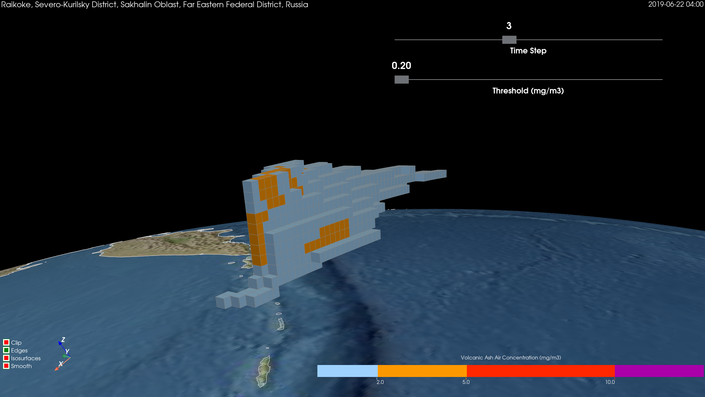

# Journal of Applied Volcanology

## Create Conda Environment

Use `conda` to download and install the package dependencies that we require within an isolated `conda` environment:

```bash
> conda env create --file env.yml
```

This will create a `conda` environment called `geovista-jav-2026` (`J`ournal of `A`pplied `V`olcanology):

```bash
> conda env list
```


Now activate the `conda` environment for use:

```bash
> conda activate geovista-jav-2026
```

This environment contains the latest development version of `geovista` from the `main`
branch of the [bjlittle/geovista](https://github.com/bjlittle/geovista) GitHub repository,
along with all of its **core** package dependencies. Most notably:

- `iris`
- `python` =3.13.*
- `pyvista` <0.47
- `pyvistaqt`

To deactivate the `conda` environment, simply:

```bash
> conda deactivate
```

## Convert QVA to NetCDF

⚠️ Please ensure that the `geovista-jav-2026` environment is activated 👍

The `NAME` model `QVA` tarball should be located in the `data` directory
i.e., `QVA_grid1.tar.gz`.

To streamline the rendering process, we unpack the tarball to multiple `QVA` files and then combine them into a single `NetCDF` file. We also:

- ensure to convert SI Units to `mg/m3`
- calculate the data range
- discard non-populated time steps in the series

```bash
> cd data
> python unpack.py
> ls -l
> cd ..
```

This will create the `data/volcanic_ash_air_concentration.nc` file.

## Explore Raikoke Dataset

⚠️ Please ensure that the `geovista-jav-2026` environment is activated 👍

To interactively explore the Raikoke dataset simply:

```bash
> python -i main.py
```

ℹ️ We require to execute `python` along with the `-i` flag (`inspect interactively`) as we are rendering the interactive scene with [pyvistaqt](https://github.com/pyvista/pyvistaqt).


